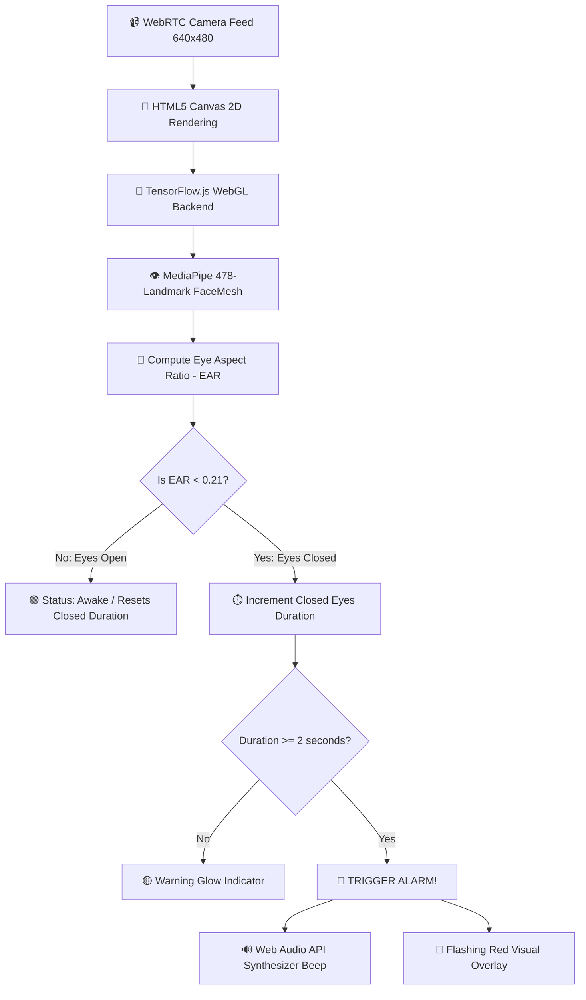

# 👁️ AI-Powered Drowsiness Detection System
## 🚗💤➡️😊 Stay Awake, Stay Safe, Save Lives!

> **Real-Time WebRTC Eye Tracking & AI Drowsiness Alert System** powered by TensorFlow.js and 478 MediaPipe Facial Landmarks. Detects driver & user drowsiness in real-time right inside the browser with **100% on-device privacy**!

[](https://github.com/Atharv-M-Patil/drowsiness-detection-system.git)
[](https://dashboard.render.com)
[](https://react.dev/)
[](https://www.typescriptlang.org/)
[](https://www.tensorflow.org/js)
[](https://expressjs.com/)
[](https://vitejs.dev/)
[](https://opensource.org/licenses/MIT)

---

## 🌟 Key Highlights & Features

| Feature | Description |
| :--- | :--- |
| **👁️ Real-Time Eye Tracking** | Tracks 478 3D facial landmarks at 30 FPS using MediaPipe Face Mesh & TensorFlow.js. |
| **📐 Scientific EAR Calculation** | Computes the Eye Aspect Ratio (EAR) using Euclidean distance between vertical and horizontal eye coordinates. |
| **🚨 Multi-Stage Alert System** | Triggers visual warning pulses and synthesized audio alarms when eyes stay closed for more than **2 seconds** (customizable to 5s). |
| **🔒 100% On-Device Privacy** | All computer vision processing happens locally in your browser via WebGL. No video feed ever leaves your device. |
| **⚡ High Performance** | Hardware-accelerated GPU inference via TensorFlow.js WebGL backend. |
| **🚀 1-Click Cloud Deployment** | Pre-configured `render.yaml` for seamless deployment on Render. |

---

## 🏗️ System Architecture & Data Flow



---

## 🛠️ Comprehensive Tech Stack & Tools Used

### 🧠 Computer Vision & AI Models
- **`@tensorflow/tfjs` (v4.22)**: Hardware-accelerated machine learning engine running directly in the browser via WebGL.
- **`@tensorflow-models/face-landmarks-detection` (v1.0)**: Google's MediaPipe 3D FaceMesh model tracking **478 3D facial landmarks**.

### 🎨 Frontend Ecosystem
- **React 19**: UI component architecture.
- **TypeScript 5.6**: Type-safe development.
- **Vite 7**: Ultra-fast build tool and development server with Hot Module Replacement (HMR).
- **TailwindCSS v4**: Modern utility-first CSS styling and dark mode UI.
- **Wouter**: Micro client-side router (`/`, `/drowsiness`, `/login`, `/builder`, `/screener`).
- **Lucide React**: Modern iconography.
- **TanStack React Query v5**: Asynchronous state management.
- **Web Audio API**: Browser-native sound frequency synthesizer for real-time alarm generation.

### ⚙️ Backend & Infrastructure
- **Node.js 20+ & Express 5**: Lightweight, high-performance REST API backend.
- **Esbuild & tsx**: Server bundling and fast execution engine.
- **Drizzle ORM & PostgreSQL / MemoryStore**: Database ORM and session store.
- **Passport.js**: Authentication strategy supporting local accounts and Google OAuth2.
- **Render (`render.yaml`)**: Cloud Web Service deployment configuration.

---

## 🧮 How Eye Aspect Ratio (EAR) Works

The Eye Aspect Ratio (EAR) measures eye openness by calculating the ratio between the vertical distances and horizontal distance of specific facial eye landmark points:

$$\text{EAR} = \frac{\|p_2 - p_6\| + \|p_3 - p_5\|}{2 \|p_1 - p_4\|}$$

```
Vertical Points: (p2 - p6) and (p3 - p5)
Horizontal Points: (p1 - p4)

  p2      p3
  •-------•
p1 •         • p4  ---> Eyes OPEN: EAR ≈ 0.28 - 0.35
  •-------•
  p6      p5

  ───────────      ---> Eyes CLOSED: EAR ≤ 0.21
```

- **Threshold**: EAR $\le 0.21$ indicates closed eyes.
- **Duration**: When EAR remains below threshold continuously for **$\ge 2$ seconds**, the drowsiness alarm triggers!

---

## 📁 Repository Structure

```
drowsiness-detection-system/
├── client/                      # Frontend Application
│   ├── public/                  # Static assets & favicon
│   ├── src/
│   │   ├── components/
│   │   │   ├── DrowsinessDetector.tsx  # Core webcam & AI tracking component
│   │   │   ├── layout/Navbar.tsx       # Navigation header
│   │   │   └── ui/                     # Reusable UI component primitives
│   │   ├── pages/
│   │   │   ├── Home.tsx                # Landing page
│   │   │   ├── drowsiness/             # Drowsiness detection page route
│   │   │   ├── builder/                # Resume builder route
│   │   │   ├── screener/               # Resume screener route
│   │   │   └── login.tsx               # Login & Auth page
│   │   ├── App.tsx                     # Main Router & Providers
│   │   └── index.css                   # Global styles & design system
│   └── index.html               # Main HTML entry point
├── server/                      # Express Backend Server
│   ├── index.ts                 # Server entrypoint & port listener
│   ├── routes.ts                # API routes & authentication
│   ├── storage.ts               # In-memory storage & session engine
│   └── static.ts                # Production static asset serving
├── shared/                      # Shared Types & Schemas
│   └── schema.ts                # Drizzle & Zod validation schemas
├── render.yaml                  # 1-Click Render Cloud Deployment Config
├── package.json                 # Dependency manifests & npm scripts
└── tsconfig.json                # TypeScript configuration
```

---

## ⚡ Quick Start - Running Locally

### Prerequisites
- **Node.js**: v20.0.0 or higher
- **npm**: v10.0.0 or higher
- **Webcam**: Laptop built-in camera or external USB webcam

### 1. Clone the Repository
```bash
git clone https://github.com/Atharv-M-Patil/drowsiness-detection-system.git
cd drowsiness-detection-system
```

### 2. Install Dependencies
```bash
npm install
```

### 3. Start the Development Server
```bash
npm run dev
```

The application will start on **`http://localhost:5030`** (or nearby port).

### 4. Open in Browser & Test
1. Visit **[http://localhost:5030/drowsiness](http://localhost:5030/drowsiness)**
2. Click **Start Camera** and grant webcam permission.
3. Close your eyes for 2–5 seconds to test the real-time visual warning and audio alarm!

---

## 🚀 Deployment Guide (Render)

Deploying to [Render](https://render.com) takes less than 2 minutes thanks to the included `render.yaml` specification:

1. Push your code to your GitHub Repository:
   ```bash
   git push origin main
   ```
2. Log into your [Render Dashboard](https://dashboard.render.com).
3. Click **New +** $\rightarrow$ **Web Service** and select `Atharv-M-Patil/drowsiness-detection-system`.
4. Render automatically reads build and run settings from `render.yaml`:
   - **Environment**: `Node`
   - **Build Command**: `npm install && npm run build`
   - **Start Command**: `npm run start`
5. Click **Deploy Web Service**!

---

## 🧪 Verification Commands

You can test compilation and production builds locally at any time:

```bash
# Check TypeScript types
npm run check

# Create production build
npm run build

# Start production server
npm run start
```

---

## 📜 License & Credits

- **License**: MIT License
- **Author**: [Atharv M Patil](https://github.com/Atharv-M-Patil)
- **GitHub Repository**: [https://github.com/Atharv-M-Patil/drowsiness-detection-system.git](https://github.com/Atharv-M-Patil/drowsiness-detection-system.git)
